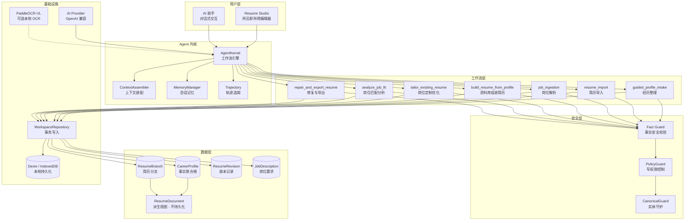
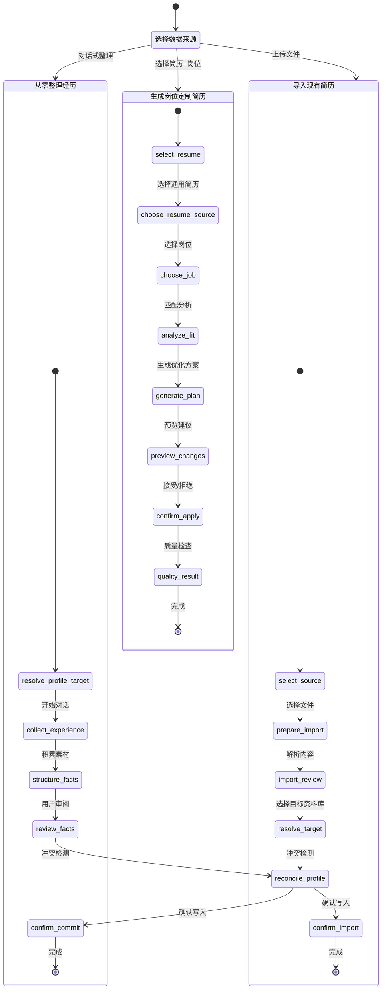
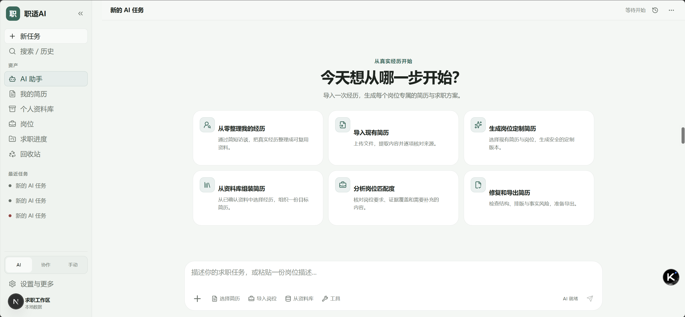
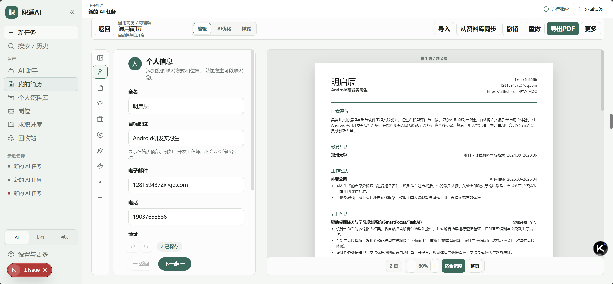
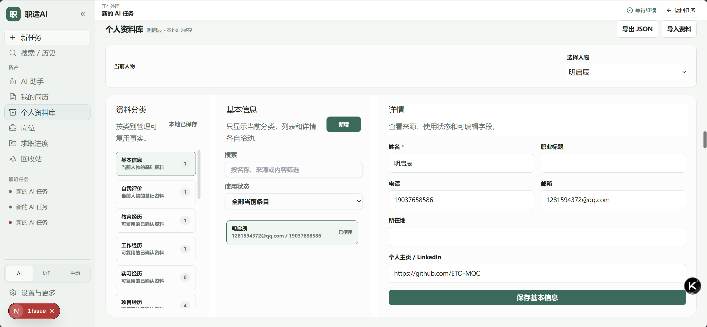
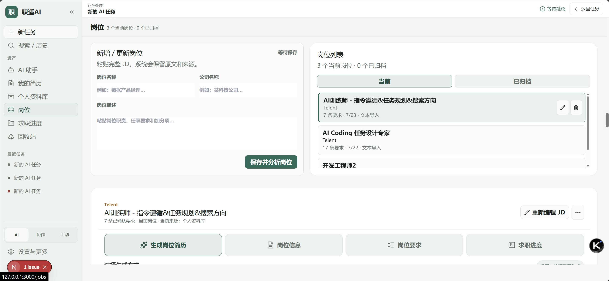

<div align="center">

# 职适 AI · CareerAdapt AI

**本地优先的智能简历工作台 —— 让每一份简历都有据可查**

[]()
[](LICENSE)
[]()
[]()

[🚀 快速启动](#快速启动) · [📐 系统架构](#系统架构) · [🔄 工作流程](#agent-工作流程) · [📸 界面预览](#界面预览) · [🏆 项目优势](#与同类产品对比)

</div>

---

## 产品简介

职适 AI（CareerAdapt AI）是面向大学生、应届生和职业早期用户的**本地优先求职材料工作台**。与传统的"AI 一键生成简历"不同，职适 AI 以**可追溯的 CareerProfile 为事实来源**，支持从简历文件或自然对话整理职业资料，并从同一资料库生成彼此隔离的通用简历与岗位简历。

**核心理念：AI 不能编造事实，只能帮你整理和呈现真实的你。**

### 核心能力

| 能力 | 说明 |
|------|------|
| 📥 智能导入 | 支持 PDF、DOCX、JSON 多格式导入，逐项核对来源后写入个人资料库 |
| 💬 对话整理 | 通过自然对话整理经历候选，未经确认的内容不会进入正式资料库 |
| 📚 个人资料库 | 结构化管理个人信息、教育、工作、项目、技能等可复用事实 |
| ✏️ 简历编辑器 | 左栏编辑 + 右栏实时预览，所见即所得 |
| 🎯 岗位定制 | 从同一资料库生成岗位专属简历分支，保留来源版本和匹配记录 |
| 🛡️ Fact Guard | AI 建议必须经过事实校验，高风险修改直接阻断 |
| 📄 PDF 导出 | 直接下载生成 PDF，支持分页检查和渲染完整性验证 |
| 🔄 版本追溯 | 每次编辑创建 ResumeRevision，完整记录内容变更历史 |

---

## 🏆 与同类产品对比

| 特性 | 职适 AI | 传统 AI 简历生成器 | 在线简历编辑器 |
|------|---------|-------------------|---------------|
| **数据存储** | 纯本地 IndexedDB，零上传 | 云端存储 | 云端存储 |
| **AI 事实安全** | ✅ Fact Guard 逐条校验，`unsafeAllowed=0` | ❌ 无法验证 AI 生成内容真实性 | ❌ 无 AI 能力 |
| **岗位定制** | ✅ 同一资料库 → 多岗位分支，互不干扰 | ⚠️ 每次重新生成 | ❌ 需手动复制修改 |
| **来源追溯** | ✅ 每条事实可追溯到原始导入/对话 | ❌ 无来源记录 | ❌ 无来源记录 |
| **版本控制** | ✅ 内容 Revision + 操作记录 | ❌ 无版本历史 | ⚠️ 有限版本 |
| **隐私保护** | ✅ 数据不离开浏览器 | ❌ 数据上传服务器 | ❌ 数据上传服务器 |
| **多人物支持** | ✅ 多 Profile 独立管理 | ❌ 仅单人 | ❌ 仅单人 |
| **自然语言交互** | ✅ AI 助手引导式对话 | ⚠️ 简单生成 | ❌ 无 |

### 为什么不能只是更多模板？

> 模板数量只能改善第一眼观感，不能解决"内容怎么改、改完是否真实、导出是否稳定、不同岗位如何复用"的核心问题。职适 AI 的模板只控制视觉，不生成事实，也不吞掉用户内容。

---

## 📐 系统架构



### 核心设计原则

- **CareerProfile 是唯一事实来源**：所有简历内容最终可追溯到个人资料库中的已确认事实
- **ResumeDocument 只派生、不持久化**：编辑器视图从 Branch + Revision 实时派生，不引入额外存储
- **通用简历与岗位分支隔离**：通用简历是基线，岗位分支是显式派生，互不干扰
- **未经确认的新事实不得进入预览或 PDF**：Fact Guard 是不可绕过的安全关卡

---

## 🔄 Agent 工作流程

职适 AI 的 Agent 采用**有限状态机 + 工具白名单**的工作流架构。每个工作流定义了严格的步骤序列、每步可用的工具和 UI 操作，确保 AI 在受控范围内执行。



### AI 安全边界

| 规则 | 说明 |
|------|------|
| AI 永远不能直接写 CareerProfile | 只能生成草稿或建议，由用户确认后写入 |
| AI 不能直接创建正式简历内容 | 建议必须经过 Fact Guard + 人工确认 |
| 无证据的 requirement 进入 fact gap | 不自动编造"补齐事实"的建议 |
| 高风险建议不可接受 | `blocked_high_risk` 和 `needs_edit` 直接阻断 |
| Provider 失败保留用户现有内容 | 不因 AI 不可用而丢失已编辑内容 |

---

## 📸 界面预览

### AI 助手 —— 从真实经历开始

通过引导式对话，帮你把零散经历整理成结构化的可复用资料。

<div align="center">

</div>

### 简历编辑器 —— 左栏编辑，右栏实时预览

所见即所得的编辑体验，左侧结构化编辑，右侧实时渲染 PDF 效果。

<div align="center">

</div>

### 个人资料库 —— 可复用的事实来源

按类别管理可复用事实，支持按分类浏览、搜索和详情查看。

<div align="center">

</div>

### 岗位管理 —— 粘贴 JD，系统保留原文和来源

支持多岗位管理，每个岗位独立保存要求、匹配结果和定制简历。

<div align="center">

</div>

---

## 快速启动

### 环境要求

- Node.js `>=20.9.0`
- pnpm `10.29.2`

### 安装与运行

```bash
# 克隆仓库
git clone https://github.com/ETO-MQC/CareerAdapt-AI.git
cd CareerAdapt-AI

# 安装依赖
pnpm install --frozen-lockfile

# 启动开发服务器
pnpm dev
```

打开 `http://localhost:3000` 即可使用。

### 配置 AI Provider

在项目根目录创建 `.env.local` 文件：

```bash
# 必填：AI Provider 配置
AI_PROVIDER=openai-compatible
AI_API_KEY=your-api-key
AI_BASE_URL=https://your-provider.example/v1
AI_MODEL=your-model-name

# 可选：本地 OCR Sidecar（扫描件识别）
PADDLEOCR_VL_ENDPOINT=http://127.0.0.1:8765
PADDLEOCR_VL_TOKEN=replace-with-a-local-random-token
PADDLEOCR_VL_MODEL_DIR=C:\path\to\PaddleOCR-VL-1.6
PADDLEOCR_VL_DEVICE=gpu
```

> ⚠️ 不要把 API Key 写入前端代码或提交到仓库。AI Provider 不可用时，系统会保留原始证据并降级为人工核对。

---

## 验证方式

```bash
# 一键验证（typecheck + lint + test + build）
pnpm verify

# 分步验证
pnpm typecheck    # 类型检查
pnpm lint         # 代码规范
pnpm test         # 单元测试
pnpm build        # 生产构建

# 专项验证
pnpm test:c1:eval    # C1 评估
pnpm test:c2:eval    # C2 评估
pnpm test:e2e        # 端到端测试
```

---

## 技术栈

| 层级 | 技术 |
|------|------|
| 框架 | Next.js 16 + TypeScript |
| 编辑器 | Tiptap (ProseMirror) |
| 状态管理 | Zustand |
| 样式 | Tailwind CSS |
| 持久化 | Dexie (IndexedDB) |
| Schema 校验 | Zod |
| AI 集成 | OpenAI 兼容 API |
| OCR | PaddleOCR-VL (可选本地) |
| 测试 | Vitest + Playwright |
| 包管理 | pnpm |

---

## 项目结构

```
src/
├── agent/                  # AI Agent 内核
│   ├── kernel/             # AgentKernel, ContextAssembler, PolicyGuard
│   ├── runtime/            # TaskStateReducer, SSE, 工作流执行
│   ├── workflows/          # 有限状态机工作流定义
│   ├── contracts/          # 类型契约
│   └── capabilities/       # 产品能力清单
├── domain/                 # 领域模型
│   ├── schemas/            # Zod Schema 定义
│   ├── resumeFields/       # 字段目录与栏目定义
│   ├── resumeImport/       # 导入解析与映射
│   ├── resumeRender/       # 渲染模型派生
│   └── jobOptimization/    # 岗位匹配与建议
├── services/               # 服务层
│   ├── agent/              # Agent 工具服务
│   ├── resumeImport/       # 导入语义映射
│   └── storage/            # WorkspaceRepository
├── components/             # UI 组件
│   ├── agent/              # AI 对话与进度
│   ├── resume/             # 简历编辑器
│   └── profile/            # 资料库管理
├── app/                    # Next.js 路由
└── stores/                 # Zustand 状态
```

---

## 已知限制

- 本项目仍处于 Beta RC；不应在尚未完成实际 Golden Journey 验收时用于不可恢复的正式求职材料流程。
- AI 能力需要配置兼容 Provider；Provider 不可用时会保留原始证据并降级为人工核对。
- 扫描件 OCR 依赖可选的本地 PaddleOCR-VL sidecar；未配置时会提示改用文本层文件或人工核对。
- 复杂 PDF、浮动 DOCX 文本框和高度视觉化版式可能需要人工校对。
- 当前主要面向桌面浏览器；完整浏览器矩阵、外部 AI 和 OCR 不属于基础确定性 CI。

---

<div align="center">

**Built with ❤️ for job seekers who care about truth**

[⬆ 回到顶部](#职适-ai--careeradapt-ai)

</div>
